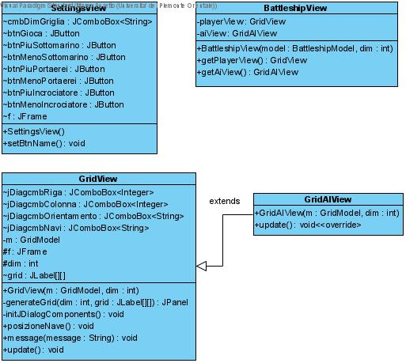

# UPO-JAVA-lab-exam-2020
 
## Progetto esame Paradigmi di Programmazione

Il progetto implementa in liguaggio Java il gioco della battaglia navale.

Lo sviluppo è stato svolto secondo il pattern MVC ed è corredato da classi di test.
L'applicazione permette tramite interfaccia grafica la scelta della dimensione della griglia di gioco del numero di navi presenti e il loro posizionamento.

> Lapplicazione è basata su `Java 8`

> Lo sviluppo ha seguito il pattern `TDD` tramite utilizzo del framework `Junit 4`

### Utilizzo
Per eseguire l'applicazione lanciare la classe
```
BattleshipLauncher.java
```

### Immagini Interfaccia utente
<table>
 <tr>
  <td></td>
  <td>
  <td>
  <td>
 </tr>
</table>

### Schemi UML
#### Modello


#### Vista


#### Controller


### Schemi funzionamento AI

#### Diagramma degli stati


#### Flowchart funzionamento AI
[Visualizza il Flowchart completo](img/Diagramma_flowchart_ai.jpeg)
